# anly502-project

# Group members: 
Ning Hu,
Xiangyu Hu,
Dongru Jia,
Xiwen Zhang,
 
# Group name:
Winner Winner Chicken Dinner

# Executive Summary:
This project mainly talks about the game Player Unknown’s Battlegrounds. According to the exploring description analysis, Spark machine learning and other methods to try to  predict the team placement of the game, recommended the weapons in the game and helped players arrange their path and locations. Hope that players can find easier ways to win the game and game companies can improve the game more wisely. 

# Introduction
Playing video games is a good way of relaxing and escaping from pressure. But losing every game certainly does not serve any of the two purposes. So how to become a more competitive player in video games, in our case PUBG, is the focus of the project. By applying a couple machine learning models to the game data to analyze and extract the best way of winning and coming on top of other players, and try to give suggestions to game companies on how to improve the gameplay is the goals of the project.
The game that is used in this project is Player Unknown’s Battlegrounds (PUBG), an online multiplayer battle game developed and published by PUBG Corporation, a subsidiary of South Korean video game company Bluehole. Maximum one hundred players will parachute onto an island and search weapons and equipment to kill each other and the last one or team who survived will win the game.
The dataset was directly downloaded from Kaggle.com, a Kaggle user extracted over 720,000 competitive matches of the PUBG game from pubg.op.gg, a game tracker website.
This dataset provides two zips: “aggregate” and “deaths”.
In aggregate, each match's meta information and player statistics are summarized (as provided by PUBG). It includes various aggregate statistics such as each player’s survival time, damage conducted, distance walked, etc. as well as metadata on the match itself such as queue size, fpp/tpp, date, etc.   
In deaths, the files record every death that occurred within the 720k matches. That is, each row documents an event when a player is taken out from the game in the match. Deaths datasets include the locations, names, and placements of killer and victim, and also how they were taken out.

# Code files
https://github.com/jiadR/anly502-project

# Analysis/Method Selection
## Data Cleaning
### Aggregate Dataset
Combining the file together is the first step.
After dropping the missing value, the aggregate file contains 67369231 rows of data. 

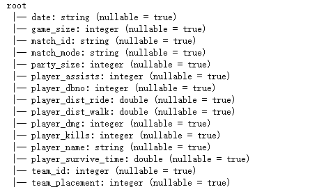

(Figure 1.1 the Schema of aggregate data)

The unused variables like date, macth_id, player_name and team_id were all dropped because they are not useful for the analysis part.
Some variables’ data type should be changed according to figure 1.1, the schema of the data. ‘player_dist_ride’ and ‘player_dist_walk’ means the distance the player walks or rides in the game, so they should be changed into integer type. ‘player_survive_time’ here also should be changed into integer type because it is the time the player survived in the game.

For ‘game_size’ and ‘party_size’ and ‘macth_mode’, they are qualitative and categorical variables, so using the StringIndexer method to transform them into double type in order to fit the models.

The ‘teamplacement’ is the predict label in this data, so it is also transformed as a double type.
According to the summary description of the data, the variable ‘player_survive_time’ has an extremely large value that was unusual. Based on the game’s condition, the survival time cannot be longer than 5000 seconds, so in this column, the value that more than 5000 will be dropped. After this procedure, it now has 67369186 rows, 45 rows were removed.
After containing all the predictors into a vector by VectorAssembler, the features also need to be scaled. Using StandardScaler to transform the features’ vector into a normalize and standard vector. 

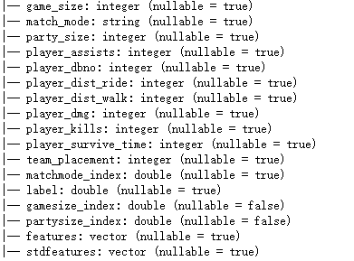

(Figure 1.2 the Schema of clean aggregate data)

Figure 1.2 shows the schema of the aggregate data after the cleaning process.

### Deaths Dataset
For the ‘deaths’ dataset, the procedure is almost the same.

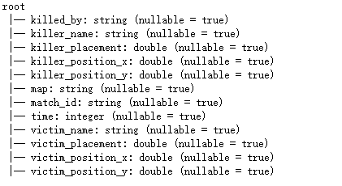

(figure 1.3 the schema of deaths data)

Figure 1.3 shows the original Schema of this dataset. It has 65370475 rows, after dropping the unused columns ‘killer_name’, ‘match_id’ and ‘victim_name’ and removing the missing value, it now has 58923976 rows of data.
Then, change the data type of the positions of both killer and victim from double to integer type.  A new feature ‘DIST’ was created to measure the distance of killer and victim in order to find the relationship between distance and weapons effect.
For ‘killed_by’, this variable represents the weapons the killer used, so transform it into a double type and name it ‘weapon index’. And the map is categorical data, so change it into double type, too.
Then, like the aggregate dataset, containing all the predictors into a vector by VectorAssembler, the features also need to be scaled. Using StandardScaler to transform the features’ vector into a normalize and standard vector. 

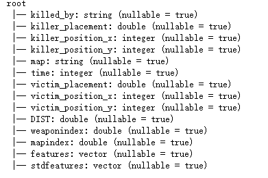

(Figure 1.4 the Schema of clean deaths data)

Figure 1.4 is the Schema that shows the deaths data after cleaning.

## EDA
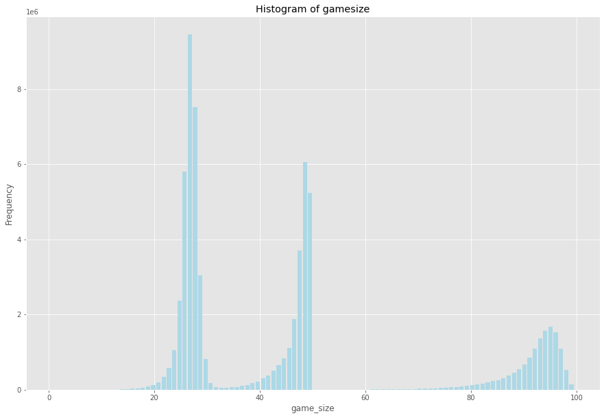

(Figure 2.1 Histogram plot of gamesize)

Figure 2.1 shows the distribution and frequency of the gamesize in the aggregate dataset. The plot was separated into two parts, the first part indicates that the relatively smaller game size, 25-30 players or 45-50 players are the most common condition. The second part is relatively larger in size, it contains mainly 90-100 players, and 100 players is the maximum number of the game.  

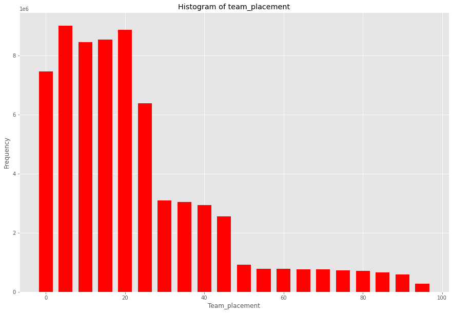

(Figure 2.2 Histogram plot of teamplacment)

Figure 2.2 shows the distribution and frequency of the teamplacement in the aggregate dataset. In this dataset, nearly 60% of the players get the team placement in the top 20. It is mainly because of the limitation of game size.  The highest frequency appears in the 5-10 interval, this stage may be the fierce part of the game, players will try their best to survive.  

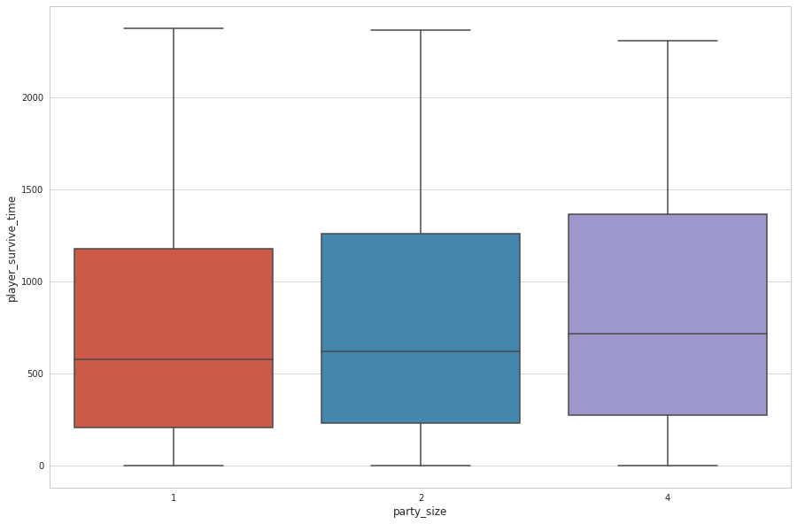

(Figure 2.3 Boxplot of party_size vs player_survive_time)

From Figure 2.3,  the box plot reflects the relationship between party_size and player survive time.  In this game, the party size has three possibilities, a team for one player only,  a team for a pair of players or 4 players.  In this plot, the party_size of 4 has the largest average value of survival time, thus, a 4 players’ team may be the best choice for the game. However, the longest survival time for the party size 4 is shorter than the others. Although 4 players’ team can take advantage, it also has the risk of losing the game at the same time.  

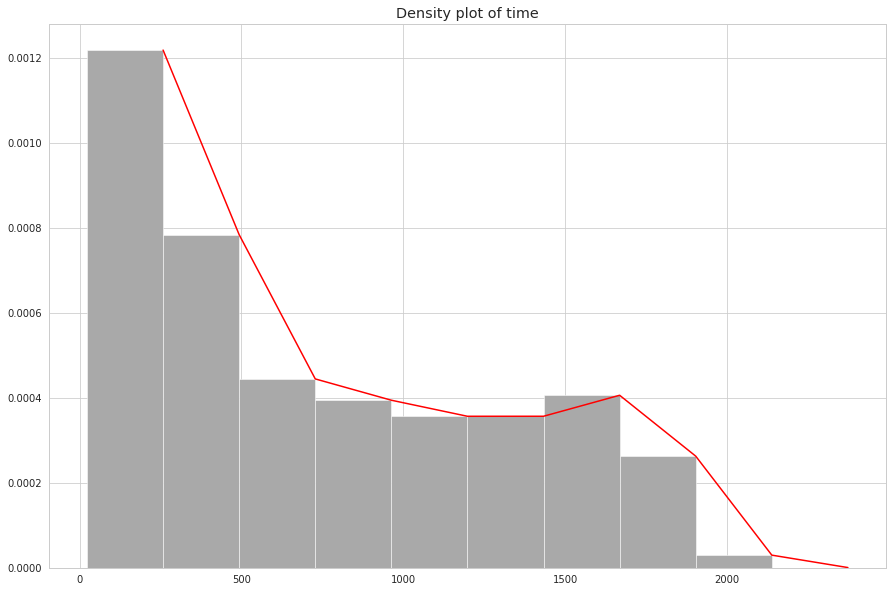

(Figure 2.4 Density plot of time)

Figure 2.4 is about the time variable in the deaths dataset. More than half of the players can only survive for 0-500 seconds, points out that the rhythm of the game is very fast, players need to be very concentrated. As the time increases, the frequency decreases, but when the time interval from 1250 to 1750, the frequency increases a little, many players can survive until that time may win the round of the game.    

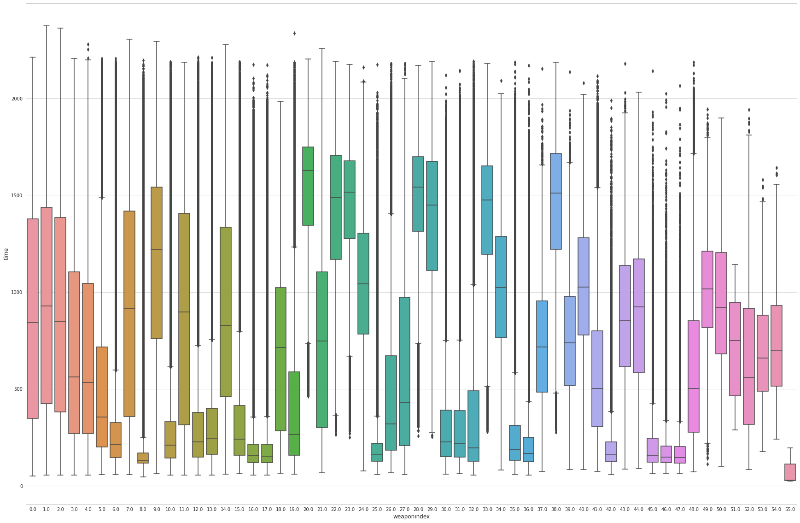

Figure 2.5 Boxplot of weapons and time)

Figure 2.5 shows different survival time of different weapons. The difference of time between weapons is obvious from this plot. In the machine learning part,  the recommendation of weapons will be discussed in more detail. 

##Heatmap

In order to help players decide their land location and route during the game to gain a better rank, we use the feature kill position and death position in map erangel in the death dataset to make three heat-maps.

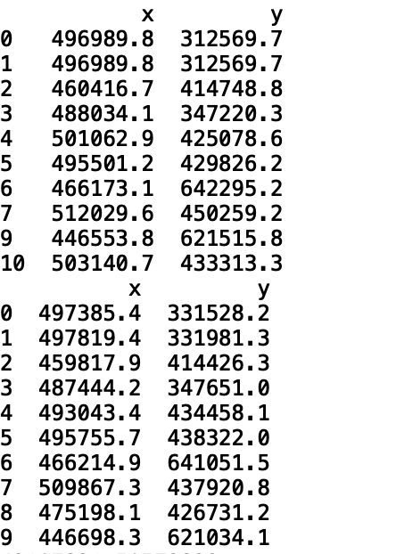
(Table 3.1 death and kill positions in dataset) 

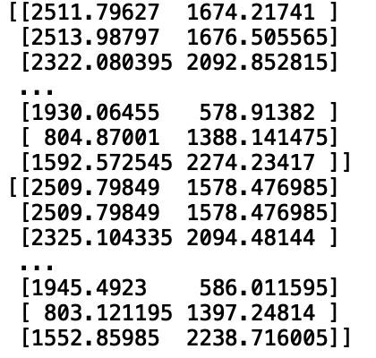
(Table 3.2 death and kill positions after scaling)

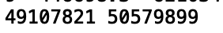
(Table 3.3 amount of Death positions and kill positions)

Three tables above are the summary of the data we used, the original location data is not suitable for the image that was provided, so we transcribe it to image size. 

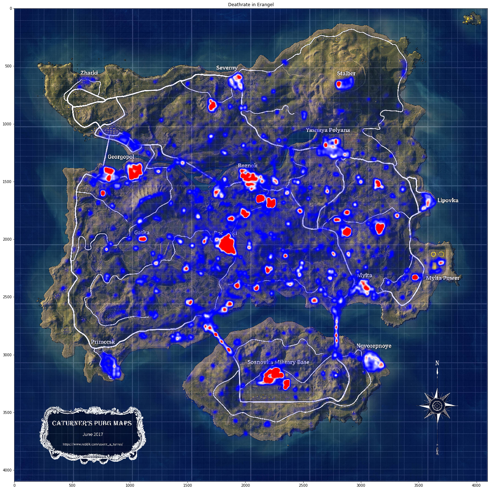

(Figure 3.1 the Death Rate in map “Erangel”)

The Figure 3.1 above is the Death Rate in the map “Erangel”. The red points are the locations where have the highest death rate. Pochinki, Georgopol, Roznok and Sosnovka Military Base are the four places where the players die the most. Novorepnoye, Severny, Gatka, Yasnaya Polyana are also dangerous locations to land. That means, if the player is new to this game, it’s essential for them to avoid landing or passing those areas. 

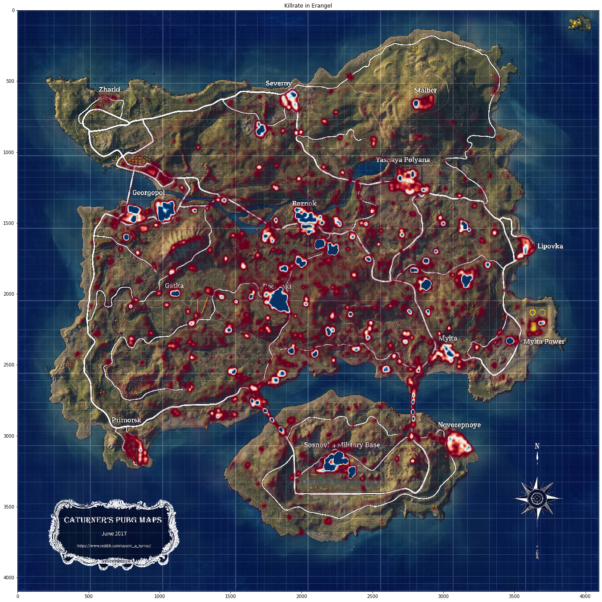

(Figure 3.2 Kill Rate in the map “Erangel”)

And Figure 3.2 is the kill rate in this map, the large red points and the blue points are the locations where players kill the most. If a player wants to take risks to gain a good kill ratio, Pochinki, Georgopol, Roznok and Sosnovka Military Base where have the highest death rate, also provide the highest kill rate. 

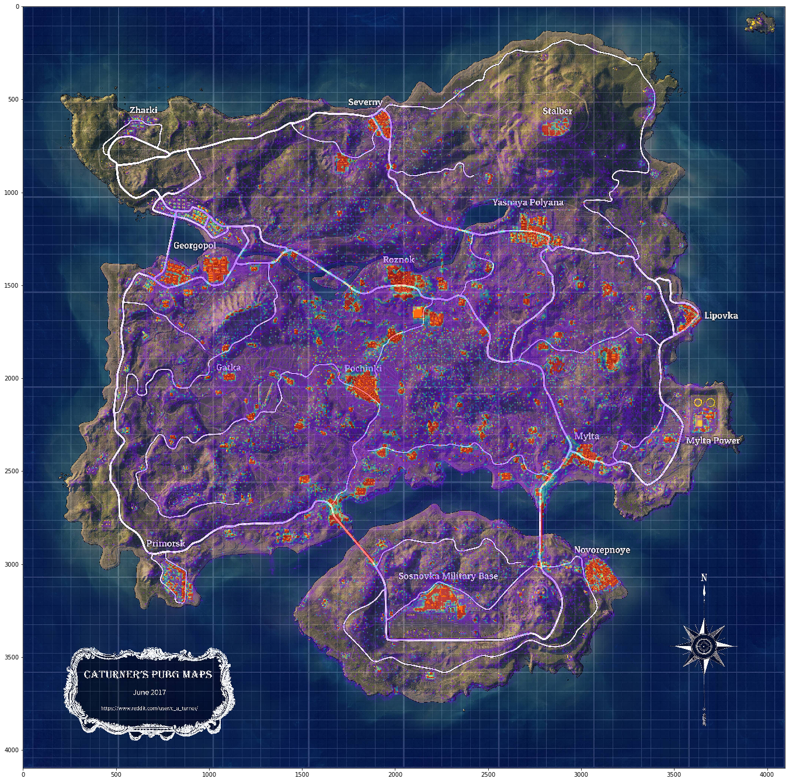

(Figure 3.3 kill/death ratio in the map “Erangel”)

In general, two figures should be nearly the same, since the killers are usually around the dead players. Then we try to investigate the kill/death ratio to help players who are skilled in this game to gain a better KDA(kill/death/assistance ratio).
The figure 3.3 above is the kill/death ratio in the map “Erangel”. The red points are the places where the kill rate is much higher than death rate. Therefore, the "hot zones" are not the only places for getting a good kill/death ratio. Anywhere that seeing red is a pretty good place for skilled players to land. 
The three plots above are good tools for both new players and skilled players to choose suitable land locations and gain an excellent rank and KDA.

## Machine learning

By using machine learning techniques, we want to answer two questions, what features play important roles in predicting placement and what weapons are the best to use based on the data.

### Predicting placement
In order to predict a player’s placement or rank in a game, given his or her previous game statistics, we applied multiple regression models, Linear Regression, Decision Tree Regression, and Gradient Boosted Tree Regression. All of the models use every feature in the  aggregate dataset, excluding survival time, as placement is ranked by survival time. For linear regression, the result is shown as follows.

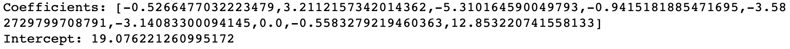

(Figure 4.1 Results of the regression model)

To evaluate the model, we split the whole dataset into train and test sets by 70 : 30 ratio, and calculated the Root Mean Squared Error and R-squared. The RMSE of Linear Regression model is 13, and the R-squared is 56.5%
Given the undesired performance of the Linear Regression model, we then fitted a Decision Tree Regression model. This time the RMSE reduced to 7. But most importantly, we can extract all the feature importance and understand what plays an important role in placement. From the Decision Tree Regression model, we found two features, “distance walked” and “party size” can explain in total almost 98% of one’s placement. Combined with the output formula from the Linear Regression model, we found that “distance walked” has a negative relationship to placement, whereas “party size” has a positive relationship, which means the shorter one player walks in the game, and the more players in his or her party, the earlier the player would get taken out of the game. To interpret the result with the previous heatmaps, we speculated that the reason for the negative relationship between “distance walked” and placement is that most players get killed in condensed areas, which are the popular sites of landing, given the sufficient amount of loots. Although the loot is plenty in these areas, one would have to take the risk of being killed by players camping in the corners and losing in the early game. For the positive relationship between “party size” and placement, one can state that larger teams could be a burden in the game; however, this could also be explained that most people playing in team mode, squads or doubles, play with their friends. And when they lose a teammate in the early game, they are very likely to play aggressively or quit the game, because people do not want to keep their friend waiting.

In order to further improve the RMSE, we also implemented a Gradient Boosted Tree Regression model. However, the GBT model reached the same performance as the Decision Tree model does. Hence, it is not further discussed in the report.

### Predicting weapon
To study which weapon can effectively kill the enemy at a given distance, a multinomial logistic regression model is applied to the Deaths dataset. The data was split into a training set and a testing set with a 7:3 ratio. The target variable is “killed_by”, which is the weapon used. All the other variables in the Deaths dataset are used as predicting variables. This model is expected to be used to make weapon recommendations for players based on their location, enemy distance and game time. However, the performance of the result was not as it was expected. The accuracy of the training set is 18.2% and the accuracy of the testing set is only 9.3%. This can not be a good model to do the prediction. 

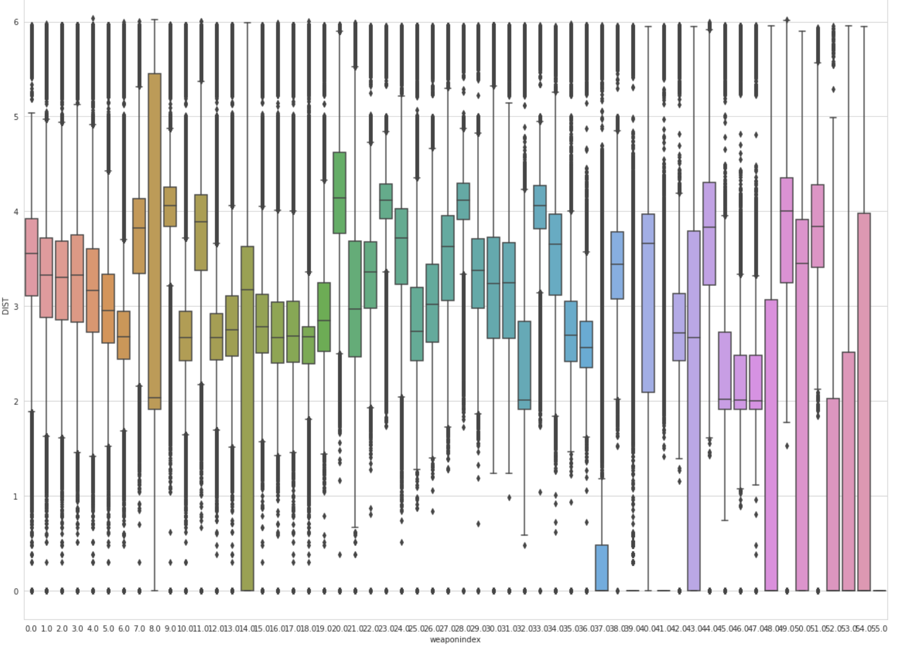

(Figure 4.2 Boxplot of weapons and distance)

To find out what could cause such bad performance, we further investigated the dataset and found several problems that could lead to such a result. First, by looking at Figure 4.2, we can see that the effective range of the weapons are very close except for some melee weapons. The ability of the weapons is balanced in the game, there is not much difference in their attacking range. Therefore, the model can not accurately distinguish them. The other problem is there is not enough feature in the dataset to be used in the prediction. Some more features such as the category and the using frequency could be useful to increase the model accuracy.

# Results/Conclusion

Based on the machine learning analysis, the decision tree model has relatively higher accuracy and better performance.  The player can predict the placement according to his or her history information in the game by this model. ‘Party_size’ and ‘Distance_walked’ are two important variables for this game,if the player wants to win the game, the size for the party and walking distance during the game should be carefully considered. What’s more, from the three heatmaps, the new players can avoid the points and areas with high deaths rate, some skilled players can arrange their paths during the game and choose the suitable points to hide. 
Besides, game companies can appropriately change and update the game’s balance based on the model and heatmaps. For example, if some weapons have extreme performance, suitable weakening should be considered to ensure the players’ game experience. 

# Future work

The model for weapons recommendation only has very low accuracy and poor performance. The main reason for this may be the high randomness in the game. The weapons or equipment that the players can get are randomly appeared in the ground, so the players may not have so many choices.  However, considering the categorial of the weapons and frequency may help to improve the model. 
The placement prediction model can also be improved, and more detailed information may be able to be reflected in the heatmaps. Future work will focus on the parts.

# Bibliography/References

dataset reference link:
https://www.kaggle.com/skihikingkevin/pubg-match-deaths

Wikipedia about PUBG:
https://en.wikipedia.org/wiki/PlayerUnknown%27s_Battlegrounds

# Division of labor
Xiangyu Hu: Data Clean EDA 

Xiwen Zhang : Heatmap analysis

Dongru Jia : Placement Prediction

Ning Hu: Weapons Recommendation

